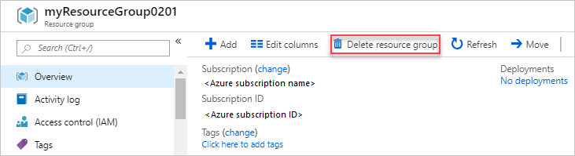

# Clean up resources

In the [previous step](./set-up-web-app.md) you worked on running the web application to display the device data on Azure Maps. In this step you will clean up all the Azure resources.

## Delete resource groups

1. Sign in to the Azure portal.
1. Select **Resource groups**
1. Select the resource group you want to open/delete
1. Select **Delete resource group**

    

## Next steps

You have completed this lab for showing GPS Direction and Positioning. You detected the GPS and directional data and sent this data to Azure IoT Hub, and further connected the Azure IoT Hub to a client application to display it on Azure Maps.

If you want to learn more about Azure IoT Services, then check out the following:

* [IoT learning paths on Microsoft Learn](https://docs.microsoft.com/learn/browse/?term=IOT&WT.mc_id=academic-7372-jabenn)
* [The IoT show on Channel9](https://channel9.msdn.com/Shows/Internet-of-Things-Show/?WT.mc_id=academic-7372-jabenn)

Once you have upskilled as an IoT developer, why not get certified with our AZ-220 Azure IoT Developer certification. Check out the details on our [certification page](https://docs.microsoft.com/learn/certifications/azure-iot-developer-specialty?WT.mc_id=academic-7372-jabenn)