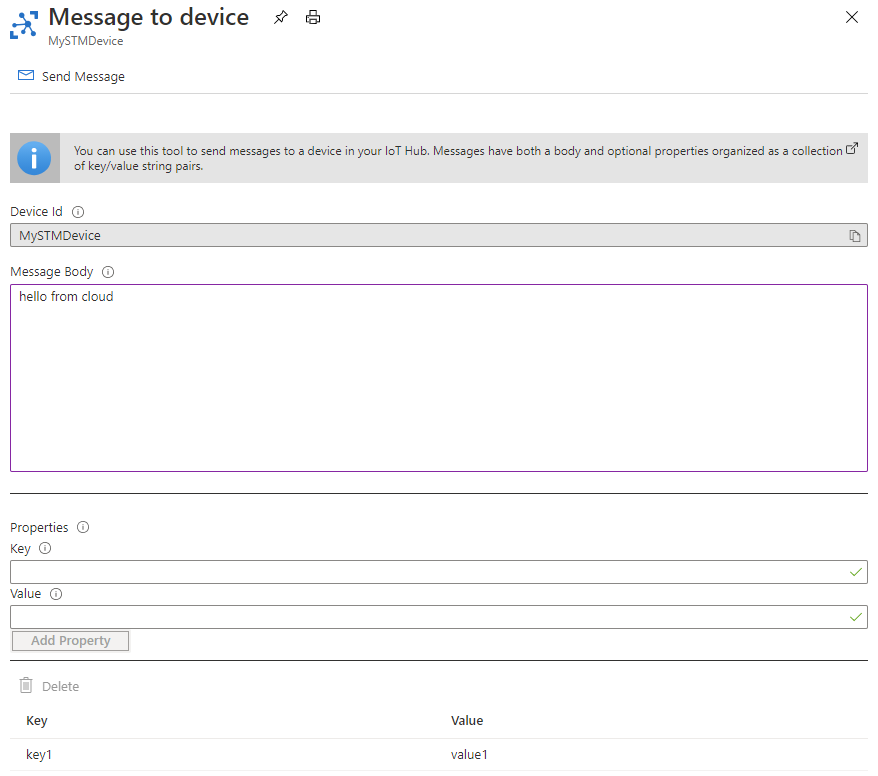

# Send Cloud to Device (C2D) message

In the [previous step](./rules-stm-function-call.md) you triggered a function on the device using IoT Explorer, Azure CLI and Azure Portal, and when the command was received, the LED was turned on/off based on the payload.

In this step you will send a message from Cloud to device and then verify if the message is received on the device.

**Use Azure Portal to send a Cloud to Device (C2D) message**

1. Sign in to Azure Portal

1. Search for the IoT Hub using the search bar and select the IoT Hub you created

1. Select the **IoT Devices** under **Explorers** section on the left navigation

1. Click on your device Id field to open the device details

    

1. Click on **Message to Device** to open the Message to Device form and fill out the details as follows:
    * **Device Id**: Readonly field that shows the device id the message will be invoked on
    * **Message Body**: The body of the message to send to the device
    * **Properties**: The user-defined properties of the message to be sent to this device
        * **Key**: The unique key for the added property
        * **Value**: The value associated with this key for the added property

    

1. Click on the **Send Message** button at the top of the form

1. Check your device to confirm the LED state.

## Next steps

In this step you sent a message from Cloud to Device and verified if the message was received on the device.

In the [next step](./set-up-azure-maps.md) you will clean setup Azure Maps.
