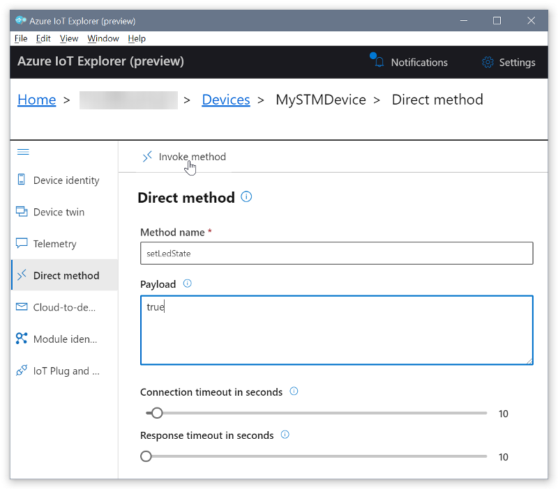
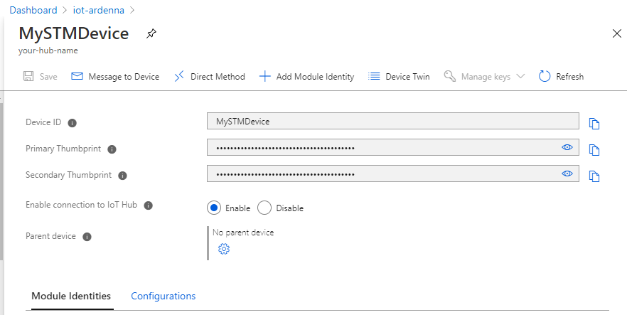
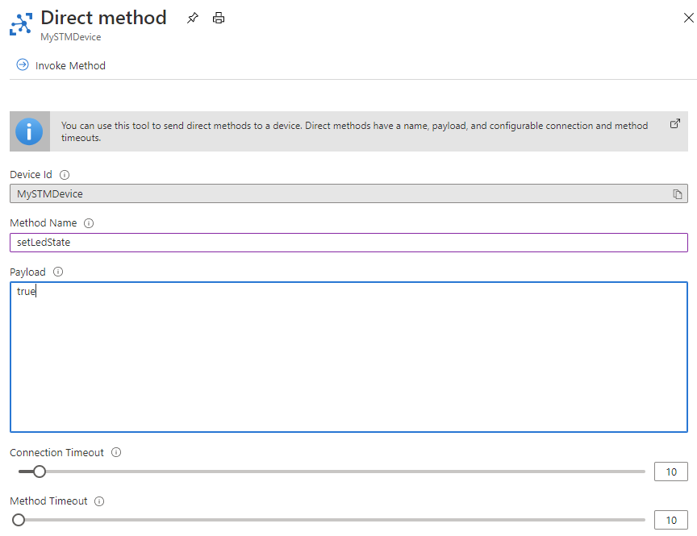

# Trigger a function on the device

In the [previous step](./set-up-stm32.md) you worked on setting up a STM32 to send device telemetry/data using the onboard and connected GPS sensor.

In this step you will trigger a function on the device from IoT Hub command.

## Call a direct method on the device

Direct methods have a name, and can optionally have a JSON payload, configurable connection, and method timeout. In this section, you call a method that enables you to turn an LED on or off. Optionally, you can perform the same task using Azure CLI.

**Use Azure IoT Explorer to call a method**

1. Select **Direct method**.

1. In the **Direct method** panel add the following values for the method name and payload. The payload value *true* indicates to turn the LED on.

    * **Method name**: `setLedState`

    * **Payload**: `true`

1. Select **Invoke method**. The LED light should turn on.

    

1. Change **Payload** to *false*, and again select **Invoke method**. The LED light should turn off.

1. Optionally, you can view the output in Termite to monitor the status of the methods.

**Use Azure CLI to call a method**

1. Run the [az iot hub invoke-device-method](https://docs.microsoft.com/cli/azure/ext/azure-iot/iot/hub?view=azure-cli-latest#ext-azure-iot-az-iot-hub-invoke-device-method) command, and specify the method name and payload. For this method, setting `method-payload` to `true` turns the LED on, and setting it to `false` turns it off.

    <!-- Inline code tag and CSS to wrap long code lines. -->
    <code style="white-space : pre-wrap !important;">
    az iot hub invoke-device-method --device-id MySTMDevice --method-name setLedState --method-payload true --hub-name {YourIoTHubName}
    </code>

    The CLI console shows the status of your method call on the device, where `204` indicates success.

    ```json
    {
      "payload": {},
      "status": 204
    }
    ```

1. Check your device to confirm the LED state.

1. View the Termite terminal to confirm the output messages:

    ```output
    Received direct method=setLedState, id=1, message=true
    LED is turned ON
    Sending device twin update with bool value
    Sending message {"ledState":true}
    Direct method=setLedState invoked
    ```

**Use Azure Portal to call a method**

1. Sign in to Azure Portal

1. Search for the IoT Hub using the search bar and select the IoT Hub you created

1. Select the **IoT Devices** under **Explorers** section on the left navigation

1. Click on your device Id field to open the device details

    

1. Click on **Direct Method** to open the invoke method form and fill out the details as follows:
    * **Device Id**: Readonly field that shows the device id the message will be invoked on
    * **Method Name**: The name of the method registered that can be invoked
    * **Payload**: Parameters that are accepted on the method or the payload for the Direct Method to invoke on this device
    * **Connection Timeout**: Number of seconds to wait until a connection is successfully made
    * **Method Timeout**: Number of seconds to wait until a result is received from the Direct Method

    

1. Click on the **Invoke Method** button at the top of the form

1. Check your device to confirm the LED state.

## Next steps

In this step you triggered a function on the device using IoT Explorer, Azure CLI and Azure Portal, and when the command was received, the LED was turned on/off based on the payload.

In the [next step](./rules-stm-c2d.md) you will send Cloud to Device message from Azure Portal.
