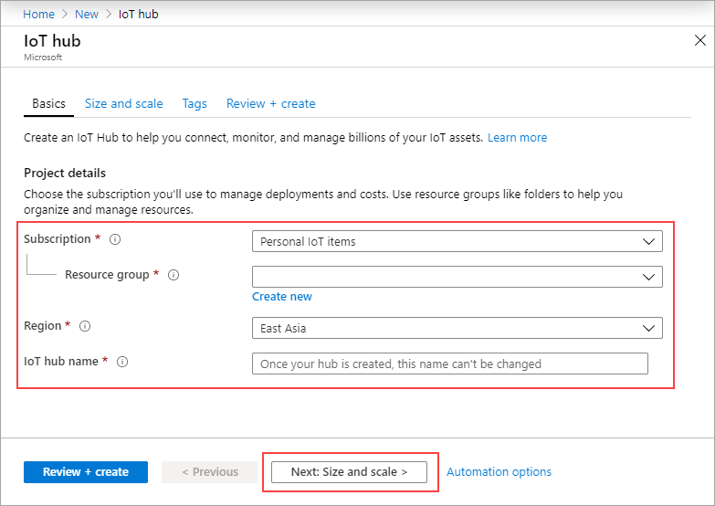
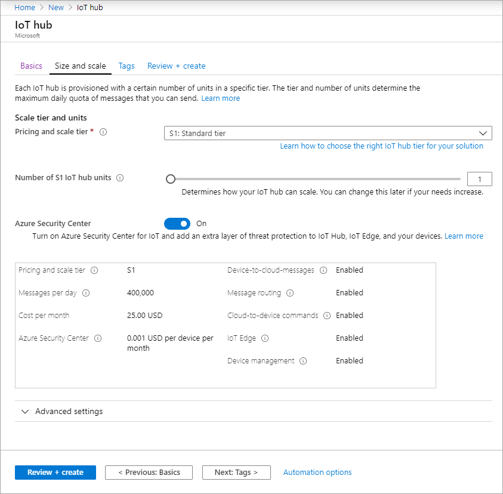
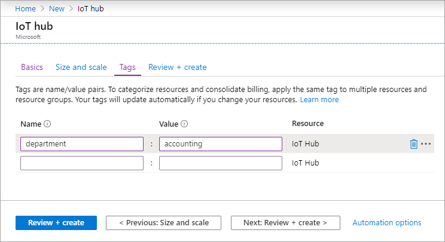
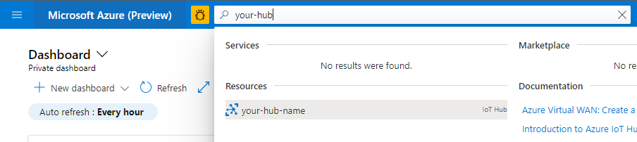
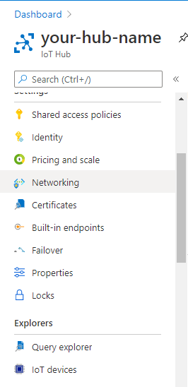
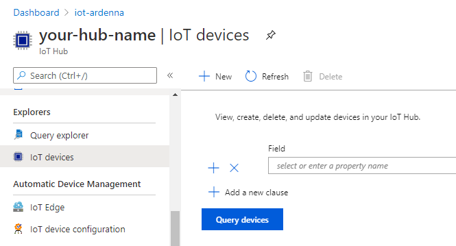
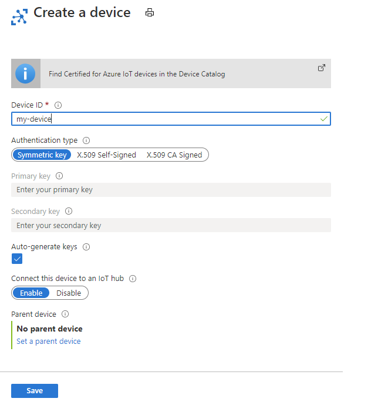

# Set up IoT Hub and Register a Device

In this step you will set up Azure IoT Hub and configure your device in the IoT Hub.

> Note: Steps listed below are copied from [Microsoft Azure docs for IoT Hub](https://docs.microsoft.com/azure/iot-hub/iot-hub-create-through-portal).

## IoT Hub

[Azure IoT Hub](https://azure.microsoft.com/services/iot-hub/?WT.mc_id=iotcurriculum-github-jabenn) provides a cloud-hosted solution back end to connect virtually any device.

Azure IoT Hub has a free tier that allows certain free messages per Iot Hub unit. If you want to send/receive more messages, you will need to select a different pricing tier. You can find pricing details on the [Azure IoT Hub pricing page](https://azure.microsoft.com/pricing/details/iot-hub/?WT.mc_id=iotcurriculum-github-jabenn).

All the documentation for IoT Hub is available in the [Microsoft IoT Hub docs](https://docs.microsoft.com/azure/iot-hub/?WT.mc_id=iotcurriculum-github-jabenn). Refer to these docs for the latest up-to date information on using IoT Hub.

IoT Hub provides 2 types of devices to be created, IoT Device and IoT Edge Device. 

### IoT Edge Devices

Azure IoT Edge moves cloud analytics and custom business logic to devices so that your organization can focus on business insights instead of data management. Scale out your IoT solution by packaging your business logic into standard containers, then you can deploy those containers to any of your devices and monitor it all from the cloud. 

Read more about [IoT Edge](https://docs.microsoft.com/azure/iot-edge/about-iot-edge).

## Create an IoT Hub

This section describes how to create an IoT hub using the [Azure portal](https://portal.azure.com/).

1. Sign in to the Azure portal.
1. From the Azure homepage, select the + **Create a resource** button, and then enter *IoT Hub* in the **Search the Marketplace** field.
1. Select **IoT Hub** from the search results, and then select **Create**.
1. On the **Basics** tab, complete the fields as follows:
  > **Important** 
Because the IoT hub will be publicly discoverable as a DNS endpoint, be sure to avoid entering any sensitive or personally identifiable information when you name it.
    
    * **Subscription**: Select the subscription to use for your hub.
    * **Resource Group**: Select a resource group or create a new one. To create a new one, select **Create new** and fill in the name you want to use. To use an existing resource group, select that resource group. For more information, see [Manage Azure Resource Manager resource groups](https://docs.microsoft.com/azure/azure-resource-manager/management/manage-resource-groups-portal).
    * **Region**: Select the region in which you want your hub to be located. Select the location closest to you. Some features, such as [IoT Hub device streams](https://docs.microsoft.com/azure/iot-hub/iot-hub-device-streams-overview), are only available in specific regions. For these limited features, you must select one of the supported regions.
    * **IoT Hub Name**: Enter a name for your hub. This name must be globally unique. If the name you enter is available, a green check mark appears.
    
  

1. Select **Next: Size and scale** to continue creating your hub.

    

    You can accept the default settings here. If desired, you can modify any of the following fields:
    * **Pricing and scale tier**: Your selected tier. You can choose from several tiers, depending on how many features you want and how many messages you send through your solution per day. The free tier is intended for testing and evaluation. It allows 500 devices to be connected to the hub and up to 8,000 messages per day. Each Azure subscription can create one IoT hub in the free tier.
    
    If you are working through a Quickstart for IoT Hub device streams, select the free tier.
    * **IoT Hub units**: The number of messages allowed per unit per day depends on your hub's pricing tier. For example, if you want the hub to support ingress of 700,000 messages, you choose two S1 tier units. For details about the other tier options, see [Choosing the right IoT Hub tier](https://docs.microsoft.com/azure/iot-hub/iot-hub-scaling).
    * **Azure Security Center**: Turn this on to add an extra layer of threat protection to IoT and your devices. This option is not available for hubs in the free tier. For more information about this feature, see [Azure Security Center for IoT](https://docs.microsoft.com/azure/asc-for-iot/).
    * **Advanced Settings > Device-to-cloud partitions**: This property relates the device-to-cloud messages to the number of simultaneous readers of the messages. Most hubs need only four partitions.

1. Select **Next: Tags** to continue to the next screen.
Tags are name/value pairs. You can assign the same tag to multiple resources and resource groups to categorize resources and consolidate billing. For more information, see Use tags to organize your Azure resources.

    

1. Select **Next: Review + create** to review your choices. You see something similar to this screen, but with the values you selected when creating the hub.

    

1. Select **Create** to create your new hub. Creating the hub takes a few minutes.

1. Once created note down the Event Hub Compatible Endppoint and Consumer Group

    

### Register a device

A device must be registered with your IoT hub before it can connect. You will use the Azure Portal to register a device.
1. Sing in to the Azure Portal
1. On the to search field at the top of the page, type the IoT hub you created in previous steps to select it

    

1. From the left navigation, under **Explorers** section, select **IoT Devices**

    

1. On the right pane, at the top, select **+ New** button to create a new IoT device

    

1. On the Create a device, complete the fields as follows:
    * **Device ID**: Enter a unique Device identity that will be used for device authentication and access control
    * **Authentication Type**: There are 3 options available to chooose from:
        * **Symmetric Key**: This is a secured access token used for authenticating a device on IoT Hub. You can either create your own which must be in valid base-64 format with a key length between 16 and 64 bytes or let the Azure Portal generate one for you (which is the default setting).
        * **X.509 Self-Signed**: A self signed certificate thumbprint for authenticating a device using a certificate.
        * **X.509 CA Signed**: A certificate issued by a certificate authority (CA)
    * **Auto-generate keys**: In case of Symmetric Key, you can keep this option if you want Azure Portal to generate a security key for your device.
    * **Connect this device to an IoT hub**: Option to either enable or disable the device once created.
    * **Parent Device**: Use this option if you want an this device to be a child device of an existing IoT edge device.

1. Click on **Save** to create your device

## Next steps

In this step, you set up an IoT Hub, and set up an IoT device.

In the [next step](./set-up-stm32.md) you will connect a physical device to IoT Hub to send device telemetry/data.
