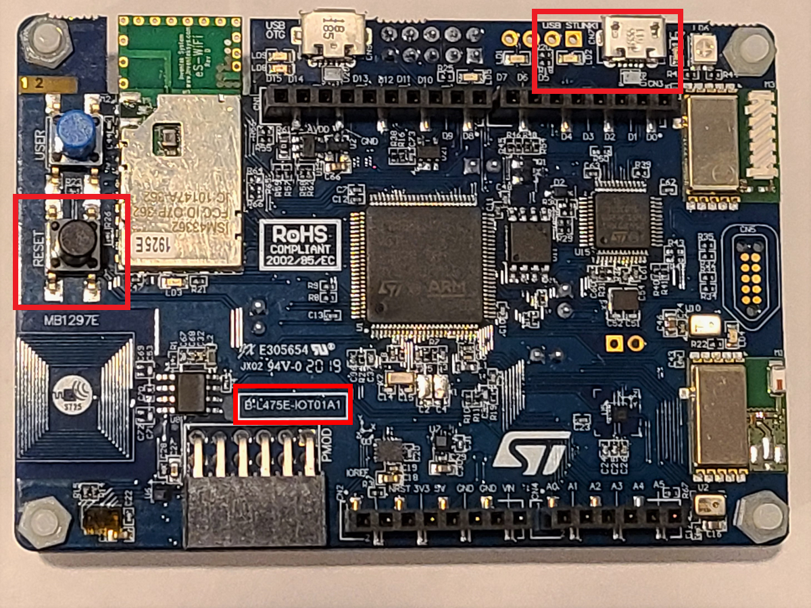

# Set up a STM32 to send device telemetry/data using the onboard and connected sensors

In the [previous step](./set-up-iot-hub-and-device.md) you set up an IoT Hub, and created an IoT device.

In this step you will set up an STM32 and a Neo 6M GPS sensor to send temperature, humidity, 3 DOF magnetometer, and GPS co-ordinates.

## STM32L475E-IOT01A Development kit

The [STM32](https://www.st.com/en/evaluation-tools/b-l475e-iot01a.html) is a low-powered Micro Controller Unit (MCU) that enables a wide diversity of applications by exploiting low-power communication, multiway sensing and Arm® Cortex® -M4 core-based STM32L4 Series features. 

The board is packed with many onboard sensors that includes temperature, humidity, barometer/pressure, magnetometer, accelerometer, gyroscope, Time-of-Flight and gesture detection, 2 digital omnidirectional microphones and support for WiFi, Bluetooth (BLE), NFC. This MCU is a bare metal and mostly used for embedded programming. It comes with 2 push buttons (user and reset) and has USB OTG FS with Micro usb connector. With this variety of sensor pack, the STM32 is capable of building many different scenarios for IoT projects.

STM32 include the freely available HAL library from ST Microelectronics along with different version of Real Time Operating Systems (RTOS) that include [Azure RTOS](https://azure.microsoft.com/services/rtos/) by Microsoft, [ARM mbed](https://os.mbed.com/), [FreeRTOS](https://aws.amazon.com/freertos/). The STM32 is an embedded platform that supports C, C++ languages.

In this lab you will use C, and program the STM32 using Visual Studio Code (VS Code), an open-source developer text editor that can be configured to build your application on PC or Mac. 

All the sensor data will come from the STM32's onboard sensors. The GPS co-ordinates will be read using a GPS sensor attached to the STM32. The GPS sensor required is a ublox [Neo 6M GPS](https://www.u-blox.com/en/product/neo-6-series) sensor.

## Hardware requirements and Prerequisites

You will need the following setup:

* A PC running Microsoft Windows (Windows 10 recommended)
* Azure subscription
* [Git](https://git-scm.com/downloads)

You will need the following hardware:

* An STM32L475E-IOT01A
* A micro USB cable
* [A uBlox Neo 6M GPS Sensor](https://www.u-blox.com/en/product/neo-6-series)
* A breadboard
* Jumper wires

## Set up the STM32 with GPS sensor

Follow below steps to connect the Neo 6m GPS sensor on STM32:

1. Connect the jumper wires on the STM32 GPIO slots. We are interested in 3 pins. Power (PWR or 5V), Ground (GND), and Digital 0 (D0). Its a good practice to use Red wires for Power, Black wires for Ground and Green/Yellow for Communicating (TX/RX) over serial port.

    > The Power connection is used to power the GPS sensor using the power source that STM32 is connected with. The D0 pin is the receiving pin (RX) on STM32 which is used to receive the GPS data using the serial port.

    

    

1. Attach the antenna to the GPS sensor, place it over a breadboard and then attach the other end of jumper wires to the sensor. 

    

    

    > Below figure shows the entire setup

    

    > You can avoid connecting the Power and Ground jumper wires and directly power the GPS sensor with a second micro USB slot available on the GPS sensor.

## Prepare the development environment

You will complete the following tasks:

* Install a set of embedded development tools for programming the STM DevKit in C
* Build an image and flash it onto the STM DevKit
* Use Azure CLI to create and manage an Azure IoT hub that the STM DevKit will securely connect to
* Use Azure IoT Explorer to view properties, view device telemetry, and call cloud-to-device (c2d) methods

### Clone the repo for the tutorial

Clone the repo to download all sample device code, setup scripts, and offline versions of the documentation. If you previously cloned this repo in another tutorial, you don't need to do it again.

`git clone --recursive https://github.com/microsoft/iot-curriculum.git`

or if you have alredy cloned the repo, you have to initialize the linked submodules for this directory with following command

`git submodule --init --recursive`

### Install programming tools

The cloned repo contains a setup script that installs and configures the required tools. If you installed these tools in another tutorial, you don't need to do it again.

> Note: The setup script installs the following tools:
* [GCC](https://developer.arm.com/tools-and-software/open-source-software/developer-tools/gnu-toolchain/gnu-rm): Compile
* [CMake](https://cmake.org/): Build
* [Ninja](https://ninja-build.org/): Build
* [Termite](https://www.compuphase.com/software_termite.htm): Monitor COM port output for connected devices
* [Azure IoT Explorer](https://github.com/Azure/azure-iot-explorer/releases): Cross-platform utility to monitor and manage Azure IoT resources

To run the setup script:

1. Open a console app with administrator privileges, go to the following path in the repo, and run the setup script named get-toolchain.bat. If you use File Explorer, right-click the file and select **Run As Administrator**.

    > [*dev-setup\get-toolchain.bat*](../code/stm32/dev-setup/get-toolchain.bat)

After the installation completes, the Azure IoT Explorer opens automatically. Keep the IoT Explorer open, you'll use it in later steps.

1. After the installation, open a new console window to recognize the configuration changes made by the setup script. Use this console to complete the remaining programming tasks in the tutorial. You can use Windows CMD, PowerShell, or Git Bash for Windows.

1. Run the following code to confirm that CMake version 3.14 or later is installed.

    `cmake --version`

### Prepare Azure resources

To prepare Azure cloud resources and connect a device to Azure, you can use Azure CLI. There are two ways to access the Azure CLI: by using the Azure Cloud Shell, or by installing Azure CLI locally. Azure Cloud Shell lets you run the CLI in a browser so you don't have to install anything.

If you prefer to run Azure CLI locally:

1. If you already have Azure CLI installed locally, run `az --version` to check the version. This lab requires Azure CLI 2.10.1 or later.
1. To install or upgrade, see [Install Azure CLI](https://docs.microsoft.com/cli/azure/install-azure-cli?view=azure-cli-latest) . If you install Azure CLI locally, you can run CLI commands in the **GCC Command Prompt**, Git Bash for Windows, or PowerShell.

If you prefer to run Azure CLI in the browser-based Azure Cloud Shell:

1. Use your Azure account credentials to sign into the Azure Cloud shell at [https://shell.azure.com/](https://shell.azure.com/)

> Note: If this is the first time you've used the Cloud Shell, it prompts you to create storage, which is required to use the Cloud Shell. Select a subscription to create a storage account and Microsoft Azure Files share.

1. Select Bash or PowerShell as your preferred CLI environment in the **Select environment** dropdown. If you plan to use Azure Cloud Shell, keep your browser open to run the Azure CLI commands in this tutorial.

    

### Prepare the device

To connect the STM DevKit to Azure, you'll modify a configuration file for Wi-Fi and Azure IoT settings, rebuild the image, and flash the image to the device.

**Add configuration**
1. In VS Code, edit the file [app\azure_config.h](../code/stm32/app/azure_config.h) to set the Wi-Fi constants to the following values from your local environment.

    | Constant name | value |
    |:---|:---|
    | WIFI_SSID | *{YOUR Wi-Fi ssid/name}* |
    | WIFI_PASSWORD | *{Your Wi-Fi password}* |
    | WIFI_MODE | *{One of the enumerated Wi-Fi mode values in the file}* |

2. Edit the same file to set the Azure IoT device information constants to the values that you saved after you created Azure resources.

    | Constant name | value |
    |:---|:---|
    | IOT_HUB_HOSTNAME | *{Your IoT hub hostName value you created in Azure portal}* |
    | IOT_DEVICE_ID | *{Your device Id value in Azure portal}* |
    | IOT_PRIMARY_KEY | *{Generated primary key for your device in Azure portal}* |

### Build the image to flash on STM32

In your console or in File Explorer, run the script [rebuild.bat](../code/stm32/build-script/rebuild.bat) at the following path to build the image:

`build-script\rebuild.bat`


After the build completes, confirm that a binary file is created. The build saves the image/binary file to the following path:

`build\app\stm32l475_azure_iot.bin`

### Flash the image on STM32

1. On the STM DevKit MCU, locate the **Reset** button, the Micro USB port which is labeled **USB STLink**, and the board part number. You will refer to these items in the next steps. All of them are highlighted in the following picture:

    

1. Use the Micro USB cable to connect the **USB STLink** port on the STM DevKit to your computer.

    > Note: For detailed setup information about the STM DevKit, see the instructions on the packaging, or see [B-L475E-IOT01A](https://www.st.com/en/evaluation-tools/b-l475e-iot01a.html#resource) Resources 

1. In File Explorer, find the binary file that you created in the previous section.

1. Copy the binary file whose file name corresponds to the part number of the STM Devkit you are using. For example, if your board part number is **B-L475E-IOT01A1**, copy the binary file named *stm32l475_azure_iot.bin*.

1. In File Explorer, find the STM Devkit that's connected to your computer. The device appears as a drive on your system with the drive label **DIS_L4IOT**.

1. Paste the binary file into the root folder of the STM Devkit. Flashing starts automatically and completes in a few seconds.

    > Note: During the flashing process, an LED rapidly toggles between red and green on the STM DevKit.

**Confirm device connection details**

You can use the Termite utility to monitor communication and confirm that your device is set up correctly.

1. Start **Termite**

1. Select **Settings**

1. In the **Serial port settings** dialog, check the following settings and update if needed:
    * **Baud rate**: 115,200
    * **Port**: The port that your STM DevKit is connected to. If there are multiple port options in the dropdown, you can find the correct port to use. Open Windows **Device Manager**, and view Ports to identify which port to use.

        

1. Select **OK**

1. Press the **Reset** button on the device. The button is black and is labeled on the device.

1. In the **Termite** console, check the following checkpoint values to confirm that the device is initialized and connected to Azure IoT.

    |Checkpoint name|Output value|
    |---------------|-----|
    |DHCP |SUCCESS: DHCP initialized|
    |DNS |SUCCESS: DNS client initialized|
    |SNTP |SUCCESS: SNTP initialized|
    |MQTT |SUCCESS: MQTT client initialized|

    The Termite console shows the details about the device, your connection, and the checkpoint values.

    ```output
    Initializing DHCP
        IP address: 192.168.1.131
        Gateway: 192.168.1.1
    SUCCESS: DHCP initialized

    Initializing DNS client
        DNS address: 192.168.1.1
    SUCCESS: DNS client initialized

    Initializing SNTP client
    SNTP time update: May 15, 2020 14:43:16.228 UTC
    SUCCESS: SNTP initialized

    Initializing MQTT client
    SUCCESS: MQTT client initialized

    Time 1589553799
    Starting MQTT thread
    Sending device twin update with float value
    Sending message {"temperature": 29.97, ... }
    ```

    > **Important**: If the DNS client initialization fails and notifies you that the Wi-Fi firmware is out of date, you'll need to update the Wi-Fi module firmware. Download and install the [Inventek ISM 43362 Wi-Fi module firmware update](https://www.st.com/content/ccc/resource/technical/binary_resources/utilities/group0/7d/0b/be/f2/6a/51/4f/a2/inventek_fw_updater/files/inventek_fw_updater.zip/jcr:content/translations/en.inventek_fw_updater.zip). Then press the **Reset** button on the device to recheck your connection, and continue this tutorial.

    Keep Termite open to monitor device output in subsequent steps.

### View device properties

You can use the Azure IoT Explorer to view and manage the properties of your devices. In the following steps, you'll add a connection to your IoT hub in IoT Explorer. With the connection, you can view properties for devices associated with the IoT hub. Optionally, you can perform the same task using Azure CLI.

To add a connection to your IoT hub:

1. In your CLI console, run the [az iot hub show-connection-string](https://docs.microsoft.com/cli/azure/iot/hub?view=azure-cli-latest#az-iot-hub-show-connection-string) command to get the connection string for your IoT hub.

    ```shell
    az iot hub show-connection-string --name {YourIoTHubName}
    ```

1. Copy the connection string without the surrounding quotation characters.

1. In Azure IoT Explorer, select **IoT hubs > Add connection**.

1. Paste the connection string into the **Connection string** box.

1. Select **Save**.

    

If the connection succeeds, the Azure IoT Explorer switches to a **Devices** view and lists your device.

To view device properties using Azure IoT Explorer:

1. Select the link for your device identity. IoT Explorer displays details for the device.

    

1. Inspect the properties for your device in the **Device identity** panel.

To use Azure CLI to view device properties:

1. Run the [az iot hub device-identity show](https://docs.microsoft.com/cli/azure/ext/azure-iot/iot/hub/device-identity?view=azure-cli-latest#ext-azure-iot-az-iot-hub-device-identity-show) command.

    ```shell
    az iot hub device-identity show --device-id MySTMDevice --hub-name {YourIoTHubName}
    ```

1. Inspect the properties for your device in the console output.

## View device telemetry

With Azure IoT Explorer, you can view the flow of telemetry from your device to the cloud. Optionally, you can perform the same task using Azure CLI.

To view telemetry in Azure IoT Explorer:

1. In IoT Explorer select **Telemetry**. Confirm that **Use built-in event hub** is set to *Yes*.
1. Select **Start**.
1. View the telemetry as the device sends messages to the cloud.

    

    Note: You can also monitor telemetry from the device by using the Termite terminal.

1. Select **Stop** to end receiving events.

To use Azure CLI to view device telemetry:

1. In your CLI console, run the [az iot hub monitor-events](https://docs.microsoft.com/cli/azure/ext/azure-iot/iot/hub?view=azure-cli-latest#ext-azure-iot-az-iot-hub-monitor-events) command. Use the names that you created previously in Azure IoT for your device and IoT hub.

    ```shell
    az iot hub monitor-events --device-id MySTMDevice --hub-name {YourIoTHubName}
    ```

1. View the JSON output in the console.

    ```json
    {
        "event": {
            "origin": "MySTMDevice",
            "payload": "{\"temperature\": 25, ... }"
            
        }
    }
    ```

1. Press CTRL+C to end monitoring.

## Next steps

In this step, you Set up IoT devices to send device telemtry.

In the [next step](./rules-stm-function-call.md) you will trigger a method/function on the device from IoT Hub or using IoT explorer.
